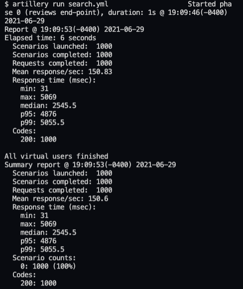
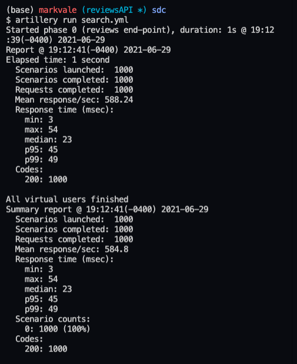

# Himilayas System Design

## Database Migration For AWS Depolyment

The Himilayas system design allows for efficient database migration. The concept of the design is a solution to a growing fashion ecommerce site's request for a scalable API using AWS. The new API and database is required to conform to the existing front-end architecture.

## Technologies Used / Requirements

Use nvm to install required nodejs version:
```bash
https://github.com/nvm-sh/nvm
```
- Node.js v14.2.0 https://nodejs.org/en/
Linux, Windows, Docker follow mongoDB install documentation https://docs.mongodb.com/manual/installation/
macOS users use homebrew to install MongoDB Community Edition locally:
```bash
- homebrew https://brew.sh/
- MongoDB v3.6.8 https://docs.mongodb.com/manual/tutorial/install-mongodb-on-os-x/
```
- Mongoose ODM v5.12.14 or higher https://mongoosejs.com/
- csv parser v3.0.0 https://www.npmjs.com/package/csv-parser
- stream-to-mongo-db https://www.npmjs.com/package/stream-to-mongo-db
- express (for local testing and development) https://www.npmjs.com/package/express
- axios v0.21.1 or higher https://www.npmjs.com/package/axios
- nginx https://nginx.org/en/
- artillery.io https://artillery.io/ 

## Installation

If you want to use the read streams to import data into a new Mongodb database open the reviews.js folder

Follow this template in order to create your stream:
```bash
const <YOUR_OUTPUT_DB> = { dbURL: 'mongodb://localhost:27017/sampleDB', collection: '<YOUR DB COLLECTION>' };
const <YOUR_WRITABLE_STREAM> = streamToMongoDB(<YOUR_OUTPUT_DB);

fs.createReadStream('<YOUR_CSV_FILEPATH>')
  .pipe(csv({
      noheader: false,
      headers: ['<YOUR_HEADER_ONE>','<YOUR_HEADER_TWO>','<YOUR_HEADER_ETC>']
  }))
  .pipe(<YOUR_WRITABLE_STREAM>);
``` 

### Stream Data Locally

- make sure you have mongoDB locally installed
- run npm start

### Run API Locally

- make sure you have mongoDB locally installed
- node db/getreviews.js start

## Testing With artillery.io

Follow the instructions in the official artillery.io documentation:
https://artillery.io/docs/guides/getting-started/writing-your-first-test.html

There is a .yml file in the root directory that can be modified accordingly.

If the test results from artillery are unsatisfactory, please check with the mongoDB documentation regarding indexing. https://docs.mongodb.com/manual/indexes/

### Example load test before indexing: 



### Example load test after indexing: 




```

## Contributing
Pull requests are welcome. For major changes, please open an issue first to discuss what you would like to change.
Please make sure to update tests as appropriate.

## License
Mark Vale 2021
